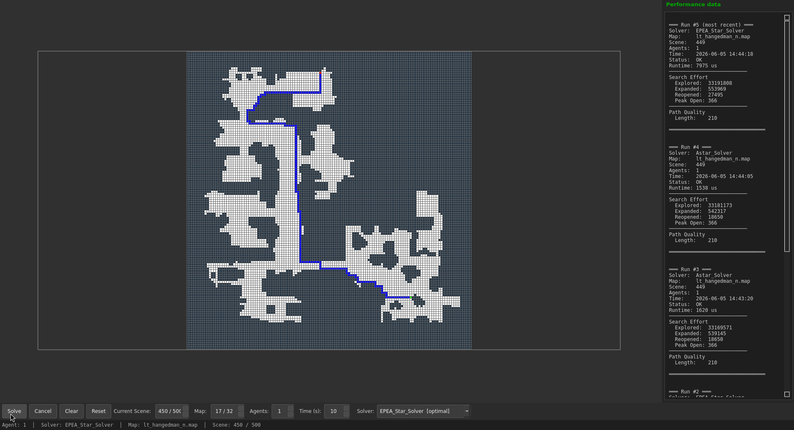
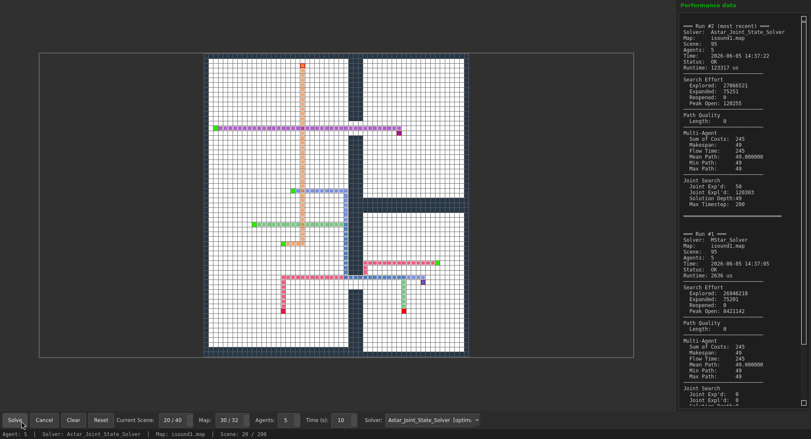

# PathSync

A C++20 pathfinding visualization tool for single-agent, multi-agent, and **multi-objective** pathfinding algorithms on grid-based maps. Supports multiple solvers with performance metrics, Pareto front browsing, and real-time visualization via Qt6.


*Single-agent pathfinding visualization*


*Multi-agent pathfinding with CBS solvers*


*Multi-objective solver with Pareto front visualization*

## Algorithms

### Single-Agent Solvers
- **A\*** (optimal) — Classic A\* with Manhattan distance heuristic (4-dir)
- **BFS** (optimal) — Breadth-First Search for unweighted grids (4-dir)
- **JPS** (optimal) — Jump Point Search with 8-directional movement and Chebyshev heuristic
- **D\* Lite** (optimal) — Incremental replanning from goal-to-start (8-dir)
- **EPEA\*** (optimal) — Enhanced Partial Expansion A\* with delayed successor generation (4-dir)
- **Theta\*** (suboptimal) — Any-angle pathfinding with line-of-sight shortcutting (8-dir)
- **HPA\*** (suboptimal) — Hierarchical Pathfinding A\* using cluster decomposition (4-dir)

### Multi-Agent Solvers
- **Joint-State A\*** (optimal) — Multi-agent pathfinding in joint state space (WIP)
- **M\*** (suboptimal) — Subdimensional expansion with independent planning + conflict resolution (4-dir)
- **CBS** (optimal) — Conflict-Based Search with Constraint Tree, vertex/edge constraints (4-dir)
- **ICBS** (optimal) — Improved CBS with conflict classification (cardinal/semi/non-cardinal) and bypass
- **CBSH** (optimal) — CBS with Conflict Graph heuristic (minimum vertex cover via brute force)

Low-level search for CBS-family solvers is **space-time A\*** by default, with **EPEA\*** as an alternative.

### Multi-Objective Solvers
- **MOA\*** (optimal) — Multi-objective A\* returning the full Pareto front
- **NSGA2** (suboptimal) — Non-dominated Sorting Genetic Algorithm II with configurable population/generations
- **ParetoRRT** (suboptimal) — Rapidly-exploring Random Tree building a Pareto-optimal set
- **Weighted Sum A\* (MO)** (suboptimal) — A\* with configurable multi-objective cost weights
- **Potential Field (MO)** (suboptimal) — Gradient descent on weighted multi-objective potential field

MO solvers appear under `── Multi-Objective ──` in the solver dropdown (WS-A\* and PotentialField use the single-agent dispatch interface and appear under `── Single-Agent ──`).

## Dependencies

| Dependency | Version | Install |
|---|---|---|
| Qt6 | 6.5+ | `sudo apt install qt6-base-dev` |
| yaml-cpp | - | `sudo apt install libyaml-cpp-dev` |
| Doxygen | - | `sudo apt install doxygen` (docs only) |
| GoogleTest | - | Fetched automatically by CMake (tests only) |

## Build

```bash
cmake -B build -S .
cmake --build build
```

All solver plugins are built automatically alongside the main binary and placed in `plugins/`.

Run:
```bash
./build/path_sync
```

Run tests:
```bash
./build/path_sync_test
```

## Architecture

The application is split into three layers:

```
┌──────────────────────────────────────────────┐
│  app/   (PathSyncApp, main)                   │
│  Orchestrates core + UI, connects signals     │
├──────────────────────────────────────────────┤
│  libs/path_sync_ui/   (Qt6 visualization)     │
│  Grid widget, toolbar, sidebar, Pareto panel  │
├──────────────────────────────────────────────┤
│  libs/path_sync_core/   (algorithms, data)    │
│  Solvers, MapManager, PathFinder,             │
│  PluginLoader, PerformanceMetrics, CostMap    │
└──────────────────────────────────────────────┘
```

### Data flow

1. **Map loading** — `MapManager` parses `.map` files into `MapData` (grid of `CellType`) and optionally loads `.map.scen` scene files. Maps without scene files (e.g. user-created custom maps) are handled gracefully.
2. **Solving** — User clicks **Solve** → `PathFinder::find_path()` (SA/MA) or `find_mo_path()` (MO) → selected solver → returns a path or Pareto front.
3. **Plugin discovery** — `PluginLoader::load_plugins("plugins/")` `dlopen`s each `.so`, queries `extern "C"` symbols, and adds it to the solver list. **All solvers** are compiled as standalone `.so` plugins — there is zero static registration.
4. **Cost maps** — Binary `.cost` files in `maps/mo_costmaps/` provide per-objective cost layers loaded at solve time.

```
Map files → MapData  →  Grid (visual)
                  ↘
     PathFinder ──→ Solver (ISolver / IMASolver / IMOSolver)
       │                 built-in or plugin .so
       │                 │
       ▼                 ▼
  PerformanceMetrics   Path result → Grid overlay
       │
       ▼
    Sidebar (last 5 runs)

  CostMap (.cost) ──→ MO Solver → Pareto Front → Radar Chart + Table
```

## Project Structure

```
├── app/                          # Application layer
│   └── src/
│       ├── PathSyncApp.hpp/.cpp  # Core app logic
│       └── main.cpp              # Standalone CLI entry
├── libs/
│   ├── path_sync_core/           # Core library
│   │   ├── include/path_sync_core/
│   │   │   ├── map_loader/       # Map & scene parsing, CostMap loader
│   │   │   ├── solvers/          # SA, MA, and MO solver headers
│   │   │   ├── mo_types.hpp           # MOSolution, MOMetrics
│   │   │   ├── solver_interface.hpp   # ISolver, IMASolver, IMOSolver
│   │   │   └── ...
│   │   └── src/
│   └── path_sync_ui/             # Qt6 visualization
│       ├── include/path_sync_ui/
│       │   ├── visualization_system.hpp
│       │   ├── radar_chart_widget.hpp     # N-axis QPainter radar chart
│       │   ├── pareto_front_panel.hpp     # Weight sliders + front table
│       │   └── cost_map_viewer.hpp        # Objective heatmap dialog
│       └── src/
├── maps/                         # Grid map files (.map, optional .map.scen)
│   └── mo_costmaps/              # Multi-objective cost map variants (.cost)
├── scripts/                      # Utility scripts
│   └── generate_cost_map_layers.py   # Cost map generator (obstacle proximity, bottlenecks, terrain)
├── config/                       # YAML configuration
├── log/                          # Solver performance logs
├── plugins/                      # Solver .so plugins (built-in + external)
│   ├── CMakeLists.txt
│   ├── demo_solver/
│   └── lib*.so
└── test/                         # GoogleTest unit tests
```

## Usage

### Controls

**Toolbar buttons:**
| Widget | Action |
|---|---|
| `Solve` | Solve current scene |
| `Cancel` | Cancel a running solver |
| `Clear` | Clear path overlay |
| `Reset` | Reset grid to original map |
| `New Map` | Create a blank custom map (specify dimensions). Persisted to `maps/custom.map` automatically |
| `Cost Map` | View cost map heatmap layers for the current map |
| `Current Scene` spin box | Jump to / step through scenes |
| `Map` spin box | Jump to / cycle maps |
| `Agent` | Cycle agent count (1–10) |
| `Solver` dropdown | Select solver directly (SA/MA/MO sections) |

**Mouse controls:**
| Action | Input |
|---|---|
| Toggle wall cell | Left-click |
| Draw walls | Left-click drag |
| Place / remove start point | Right-click (multiple starts: click different cells) |
| Place / remove goal point | Shift+right-click (multiple goals: click different cells) |

### Performance Sidebar
A permanent sidebar (320 px, right of the viewport) displays the last 5 solver runs with timing, search effort, and path quality metrics.

### MO Mode Sidebar
When a multi-objective solver is selected, the sidebar switches to the **Pareto front panel**:
- **Objective count** selector (2–5)
- **Weight sliders** per objective (normalized to 1.0)
- **Radar chart** — QPainter N-axis spider chart showing the selected front
- **Pareto front table** — up to 100 rows with cost and path length
- **Hypervolume** metric (Monte Carlo estimate)
- **Solve MO** button

## Map Format

Maps use the standard [Moving AI](https://movingai.com/benchmarks/) grid format (`.map` files with optional `.map.scen` scene files).

### Custom Maps

Click **New Map** in the toolbar to create a blank grid. Specify dimensions as `WxH` (e.g. `200x200`). Draw obstacles with left-click, place start/goal with right-click, and solve with any solver.

**Multi-agent support:** Right-click multiple cells to place multiple starts; Shift+right-click multiple cells for multiple goals. Right-click an existing start/goal to remove it. The agent count is auto-detected from placed points.

**Persistence:** Custom maps are automatically saved to `maps/custom.map` on close and when navigating away. On restart, the custom map loads automatically and appears in the map list for navigation via the **Map** spin box.

### Multi-Objective Cost Maps

`maps/mo_costmaps/` provides **multi-cost variants** of every map with 5 cost objectives generated from map structure:

| Index | Name | Description |
|---|---|---|
| 0 | Distance | Base traversal cost (flat, 1.5x on `T` terrain) |
| 1 | Risk | Obstacle proximity + narrow passage + dead-end penalty |
| 2 | Energy | Terrain-based (`T` cells cost 3×) scaled by obstacle proximity |
| 3 | Visibility | Inverse of obstacle distance (open = cheap) |
| 4 | Terrain | `T` cells cost 5× with wall-edge bonus |

Each `.cost` file is a binary float32 tensor generated by `scripts/generate_cost_map_layers.py`.

**Binary format:** `[height:i32][width:i32][objectives:i32][costs:f32...]` — row-major, per-cell blocked if any objective is -1.0.

**C++ loader:**
```cpp
#include "path_sync_core/map_loader/cost_map.hpp"

path_sync::CostMap cm;
if (cm.load("maps/mo_costmaps/arena2.cost"))
    float risk = cm.at(/*obj=*/1, /*x=*/10, /*y=*/20);
```

See `maps/mo_costmaps/README.md` for full details.

### Cost Map Viewer

Click **Cost Map** in the toolbar to open a dialog showing each objective layer as an individual heatmap, plus a combined RGB composite. The number of objectives shown matches the current MO solver setting.

## Extending

PathSync loads solver algorithms dynamically via a plugin system.

See **[HOW_TO_ADD_SOLVER.md](HOW_TO_ADD_SOLVER.md)** for a step-by-step guide with code examples. The guide covers all three solver interfaces: `ISolver` (single-agent), `IMASolver` (multi-agent), and `IMOSolver` (multi-objective).

The [`plugins/demo_solver/`](plugins/demo_solver/) directory contains a complete working plugin (Greedy Best-First Search) that you can use as a template.

## License

GNU General Public License v3.0
